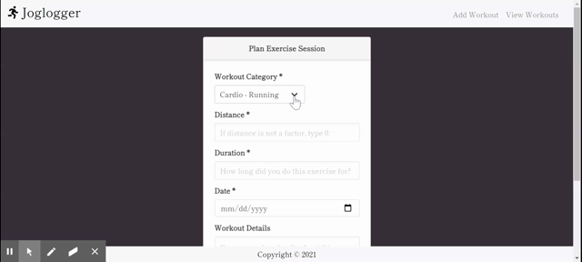

<h1 align="center">Joglogger</h1>

  [](https://opensource.org/licenses/MIT)


## Table of Contents

  - [Description](#description)
  - [Demo](#demo)
  - [Installation](#installation)
  - [Usage](#usage)
  - [Contributors](#contributors)
  - [Tests](#tests)
  - [License](#license)
  - [Technologies](#technologies)
  - [Questions](#questions)

  
  ## Description
  The Joglogger is an application that allows the user to input their daily workouts - which includes the workout category, distance, duration, date, and any other details about their exercise session. We wanted to create a user interface that is easy to maneuver and allows the user add, view, and delete their workouts when they are completed if necessary.

  
  ## Demo

  

  To launch the application, please visit this link to Heroku - https://vast-inlet-10059.herokuapp.com/add_workout
  
  ## Installation
  Joglogger requires the installation of Express, MySQL, Sequelize, and Handlebars from npm to run properly in a local dev environment. To install the project's npm dependencies, navigate to the project's root directory and run:

  ```
  npm i
  ``` 
 
  Once all third-party packages have been successfully installed, the application is ready to use. For more details, reference the application's ```package.json``` file.
  
  ## Usage
  To launch the application from the command line, navigate to the project's root directory and run:
  ```
  node server.js
  ```
  
  When the user opens the Joglogger, they are prompted with a card input to enter the data associated with their session. They are to choose what workout category their workout was related to, how long they did the workout for, the distance they went with this workout (if applicable), the date they did or plan to do the workout, and any other details the inputs did not cover (i.e. reps, weight, etc.). From there, they can click "Add Workout" and that data will be sent to the database. If they do not enter in the correct credentials, they will be notified with a pop-up. If they choose to add another workout, they will be shown the same page with an empty input form. 
  
  If they want to view their workouts, they will need to click the "View Workouts" link in the navbar. There, they will be shown two card containers containing information from the database. One holds the workouts that need to be completed with the details of that session and the other containing the workouts they have already completed. The user can delete the workouts completely from the database after they have completed the workout session.


  ## Contributors
  J.K. Royston - <jkroyston@gmail.com> - [J.K.'s GitHub](https://github.com/jxhnkndl) - Back-end connection to database and server

  Emily Todt - <emilybtodt@gmail.com> - [Emily's GitHub](https://www.github.com/todtsies) - Front-end user interface

  Kevin Spoth - <kspoth@richmond.edu> - [Kevin's GitHub](https://github.com/kspoth) - Front-end JavaScript

  Kenneth Keller - <kenkanifffromct21@gmail.com> - [Kenneth's GitHub](https://github.com/kenkanifffromct) - Front-end JavaScript

  ## Tests
  No tests were included.

  ## License
  
        Copyright (c) 2021
        Licensed under the [MIT license](https://opensource.org/licenses/MIT).
      

  ## Technologies
  HTML, Handlebars, CSS, Bootstrap, Bulma, jQuery, JavaScript, Node.js, Font Awesome, Google Fonts


  ## Questions
  Any questions? Don't hesitate to contact us through our emails or Github accounts linked above!
